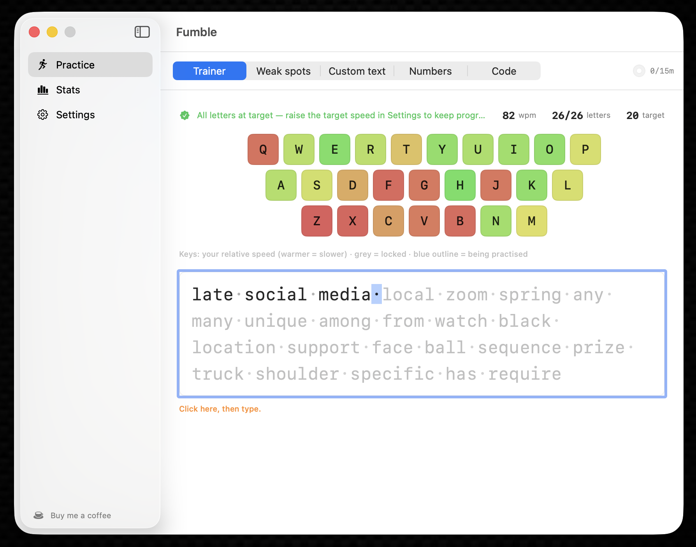
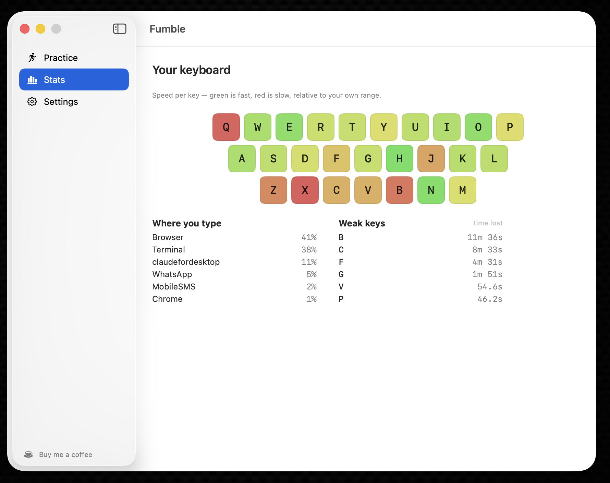

# Fumble

**A typing coach that already knows what you're bad at.**

Typing tutors make you grind synthetic drills for hours before they learn anything about you.
Fumble watches how you type all day — in your editor, your terminal, your email — and works out
which keys and which transitions actually cost you time. No cold start, and no pretending that
pseudo-random letter soup resembles the things you really type.

macOS menu bar. Free. Open source. Entirely on-device.





---

## Why not just use keybr?

keybr is good, and this exists because of two things it can't do:

1. **The cold start.** It only knows what you've typed *inside it*.
2. **The corpus.** It drills text generated from letter-frequency models. You don't type
   pseudo-English — you type `git commit -m`, `const`, `=>`, `];`, snake_case identifiers.
   The transitions that actually cost you time barely appear in its lessons.

Fumble measures the real thing.

## What it shows you

- **Honest WPM** — see [Honest numbers](#honest-numbers).
- **Weak keys**, ranked by *how much time they cost you today*, not by raw slowness.
- **Weak transitions** — the key pairs that hurt. `];` and `->` cost real time while the
  individual keys look fine.
- **Correction rate** per key — where you backspace most. Accuracy and speed are separate
  problems with separate fixes.
- **Per-app breakdown** — where the typing actually happens.

### Ranked by time cost, not by slowness

The headline metric is **seconds lost today**: how much slower than your own baseline a key is,
multiplied by how often you hit it.

This matters. A key you hit 50 times at +220ms costs you 11 seconds. A key you hit 2,000 times
at +40ms costs you 80 seconds. The second one is the problem, and "slowest key" ranking buries
it. "`;` cost you 80 seconds today" is also a claim you can accept or reject — which a composite
score with tuned weights would not be.

### Judged against you, not a target

Your baseline is the median of your own per-key p95 latencies. A 40 WPM typist and a 110 WPM
typist have completely different distributions; against a fixed threshold the slower typist's
entire keyboard reads as "weak", which is useless advice.

Per-key medians rather than all your keystrokes pooled, deliberately: pooling weights each key
by how often you press it, so a frequent slow key drags the baseline toward itself and hides its
own slowness. Those are exactly the keys worth fixing.

### Same-finger transitions are flagged, not drilled

`ed` is slow for everyone — it's one finger doing two jobs. Fumble shows these but keeps them out
of drills. Telling you to grind a same-finger bigram is telling you to fix your hand.

## Honest numbers

Most typing trackers will happily report 400 WPM when you paste a paragraph. Fumble excludes:

- **Software-injected keystrokes** — text expanders, automation (Hammerspoon, Keyboard Maestro,
  `osascript`), remote-control software, AI tools that type into the frontmost app. Hardware
  events carry `kCGEventSourceStateHIDSystemState`; anything posted by a process doesn't.
  (Pastes and most editor/LLM completions never generate keystrokes at all, so they can't
  inflate the count in the first place.)
- **Key autorepeat** — holding a key down is not typing.
- **Thinking pauses** — gaps too long to be finger movement don't count as latency (the
  threshold adapts to your own per-transition speed).
- **Idle time** — it never enters the WPM denominator.
- **Fumble's own practice window** — drill text is synthetic and aimed at your weak keys, so
  it's kept out of your daily stats entirely.

Every one of these exclusions is **counted and shown** in the dropdown under "What was
excluded". The number should be auditable, not magic.

## Privacy

Fumble records **which key and when** — never the characters. What lands on disk is counters and
latency histograms: no keystroke sequence exists to replay your text. (Per-key-pair counters do
retain adjacent-pair frequencies — that residue is deliberately disclosed and bounded; see
PRIVACY.md.) Nothing is recorded while a password field has focus. There is no network code, no
account, no telemetry.

The full account, including the part that *is* a residual risk and what's done about it, is in
**[PRIVACY.md](PRIVACY.md)** — along with the commands to verify all of it yourself.

## Install

Requires macOS 14+.

```sh
git clone https://github.com/alexiscodingbits/Fumble.git
cd Fumble
bash scripts/bundle-app.sh
cp -R dist/Fumble.app /Applications/
open /Applications/Fumble.app
```

Grant **Input Monitoring** when prompted (System Settings → Privacy & Security → Input
Monitoring). Fumble cannot work without it, and cannot ship on the Mac App Store because of it:
the store mandates sandboxing, and sandboxing blocks this API.

> Release builds are **Developer ID signed and notarized** — the DMG opens on any Mac without
> Gatekeeper warnings. Self-built copies sign with whatever identity you have (see
> `scripts/bundle-app.sh`); with none, macOS re-asks for Input Monitoring after each rebuild.

## Inspect the data

```sh
cd FumbleCore
swift run fumble-cli            # today, summarised
swift run fumble-cli --all      # every day on record
swift run fumble-cli --json     # raw stored data, verbatim
```

## Practice

Fumble is a coach, not just a tracker. The practice app (menu bar → Practice) has five modes:

- **Trainer** — keybr's adaptive letter-unlocking loop, but *pre-aimed*: it seeds from your
  real captured typing, so letters you already type fast start mastered and the focus lands on
  a genuine weakness from lesson one. On-screen keyboard coloured by confidence, per-letter
  progress bars, per-key feedback (last / top / wpm-per-lesson), real-word lessons.
- **Weak spots** — continuous drills of real words weighted toward your slowest keys and
  transitions from all-day capture.
- **Custom text** — paste anything and practice it.
- **Numbers** — digit groups (Benford-distributed, like keybr).
- **Code** — symbol-heavy pseudo-code fragments.

Typing assists (stop-until-correct or advance-through), whitespace dots, cursor styles, optional
key/error sounds, and a daily goal with streaks. Practice typing is **excluded from your daily
stats** so drills can't distort the model that generates them.

## Roadmap

- [x] **M1** — capture core, latency histograms, per-key/bigram/app stats, persistence
- [x] **M3** — weak-spot ranking, dropdown UI, keyboard heatmap, stats pane
- [x] **M4** — adaptive trainer + drills + practice modes (see above)
- [x] **M5 (partial)** — Developer ID signed + notarized builds
- [ ] **M2** — validate the injected-keystroke filter against real automation tools
- [ ] **M5** — public release, Homebrew cask, auto-update
- [ ] **v2** — the interesting one: **word- and token-level** coaching. Every tool in this space
      stops at individual keys and bigrams. Nothing knows that you fumble `useEffect` or
      `provenmetal` specifically. The plan is to build that vocabulary from your own repos and
      shell history and rank it with the timing data — so the word list comes from files already
      on your disk, and the keyboard tap never needs to see words at all.

## Development

```sh
cd FumbleCore
swift build        # must be 0 warnings
swift test         # 190+ tests
```

Layout: `FumbleCore` is a pure Foundation model — no AppKit, no SwiftUI. `FumbleUI` is pure
presentation logic with no SwiftUI import, so the UI's *content* is unit-testable. `FumbleApp` is
the only target that touches SwiftUI/AppKit/CoreGraphics.

## Credits

The virtual-keycode table follows the Carbon `kVK_*` constants. Thanks to
[keyStats](https://github.com/debugtheworldbot/keyStats) (MIT) — read as prior art while working
out how to do system-wide capture on macOS.

## Licence

MIT — see [LICENSE](LICENSE).
